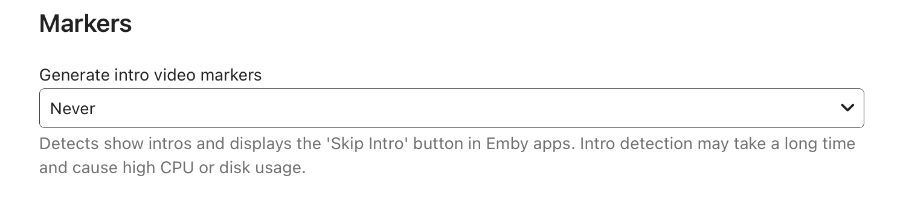
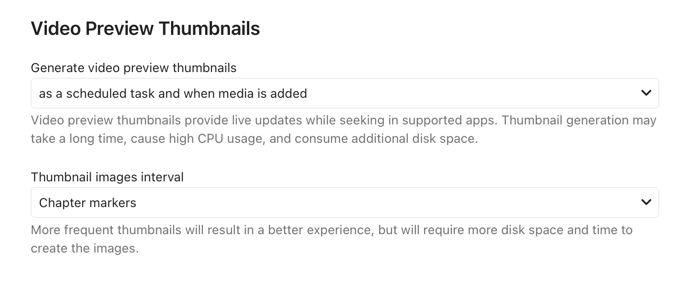
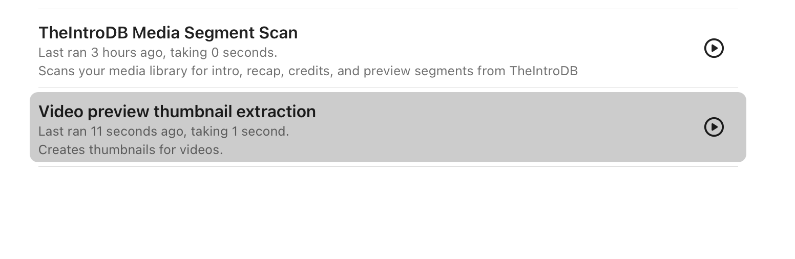
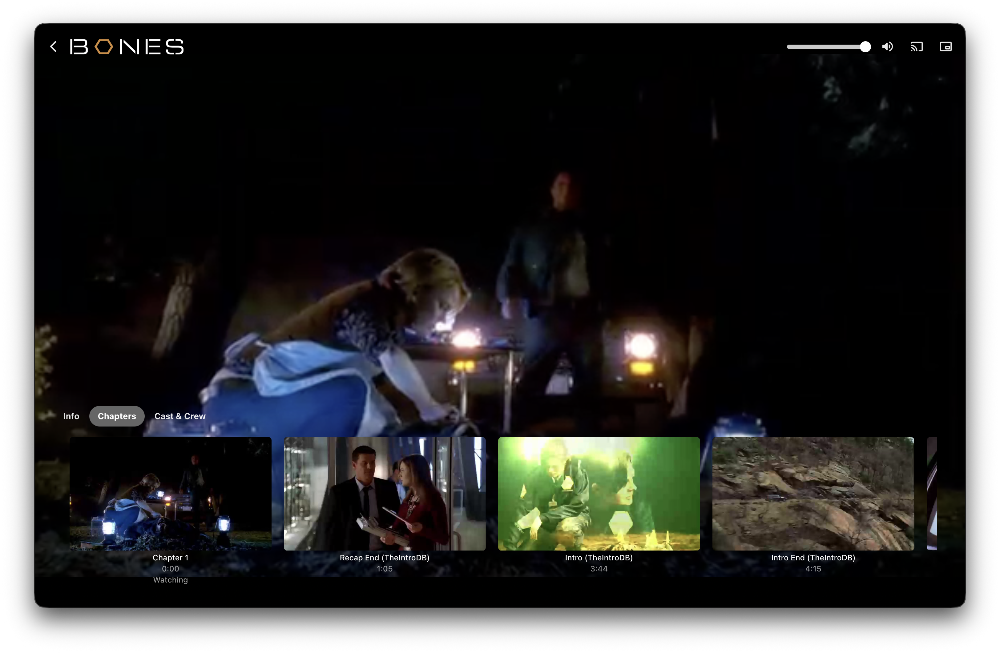

# TheIntroDB – Emby Plugin

<p align="center">
  
</p>

This plugin fetches intro, recap, credits, and preview timestamps from [TheIntroDB](https://theintrodb.org) for your Emby library. It uses this data to enable intro skipping features in compatible Emby clients.

**Requirements:** Emby Server 4.7+. **TMDb metadata is recommended** for best accuracy (IMDb works as a fallback but is less accurate for TV).

**Important:** Segments are **not** fetched when you press play. They are populated when the **TheIntroDB Media Segment Scan** scheduled task runs. Until that task has run for your library, skip features may not be available.

---

## Installation

1. Download the latest plugin release from the [Releases](https://github.com/TheIntroDB/emby-plugin/releases) page.
2. Place `TheIntroDB.dll` into your Emby plugins folder:
   - **Linux:** `/var/lib/emby/plugins/`
   - **Windows:** `C:\Users\{user}\AppData\Roaming\Emby-Server\plugins\`
   - **macOS:** `~/.config/emby-server/plugins/` or `/Library/Application Support/Emby-Server/plugins`
3. Restart Emby Server.
4. Configure the plugin at **Dashboard → Plugins → TheIntroDB**.
5. Run the scheduled task to populate data: **Dashboard → Scheduled Tasks → TheIntroDB Media Segment Scan** and click the **Play** button (▶).

Tip: use [Emby.GitHubRepoPluginInstall](https://github.com/bakes82/Emby.GitHubRepoPluginInstall) to install from releases directly!

### Metadata Requirements

**TMDb is recommended.** The plugin matches content by TMDb ID for best accuracy. Ensure your libraries are configured to fetch TMDb IDs for your movies and shows.

IMDb IDs work as a fallback but are less accurate for TV episodes. The plugin will use whichever IDs are available on your items.

## Configuration

TheIntroDB plugin includes some configuration options to adjust and improve your experience.

- **API Key**: You can enter your TheIntroDB API key to fetch your submissions even if they're still pending and prioritize yours in the averaging calculation.
- **Segment Toggles**: (All enabled by default) You can disable each segment individually so they're not applied when fetching.
- **Ignore Media That Already Has Segments**: (Enabled by default) Prevent refetching of media that already has segments. This is recommended for large libraries.

## Troubleshooting

It's recommended to disable Emby's internal intro marker detection in **Dashboard → Library → select library → Advanced/options → Disable "Generate intro video markers"**.



Thumbnail extraction is also recommended and can be done from **Dashboard → Library → select library → Advanced/options → Enable "Video preview thumbnails"**.



And by running the scheduled task again.




---

## Preview



---

## Development

### Prerequisites

- [.NET 6.0 SDK](https://dotnet.microsoft.com/download/dotnet/6.0)

### Build Commands

```bash
dotnet build
```

### Quick Test Loop

1. Build: `dotnet build`
2. Copy the DLL: `cp TheIntroDB/bin/Debug/netstandard2.0/TheIntroDB.dll /var/lib/emby/plugins/` (adjust path for your OS)
3. Restart Emby Server.
